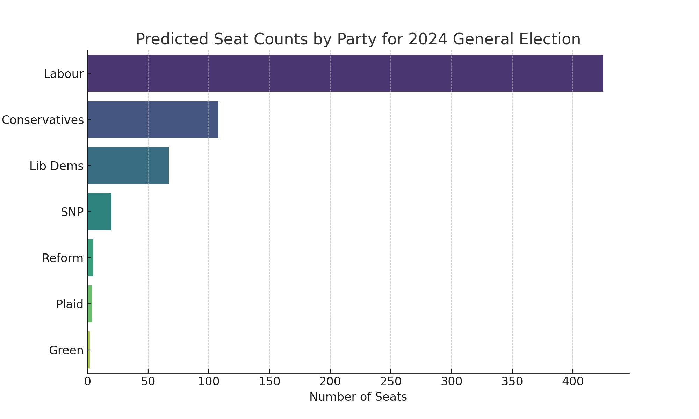
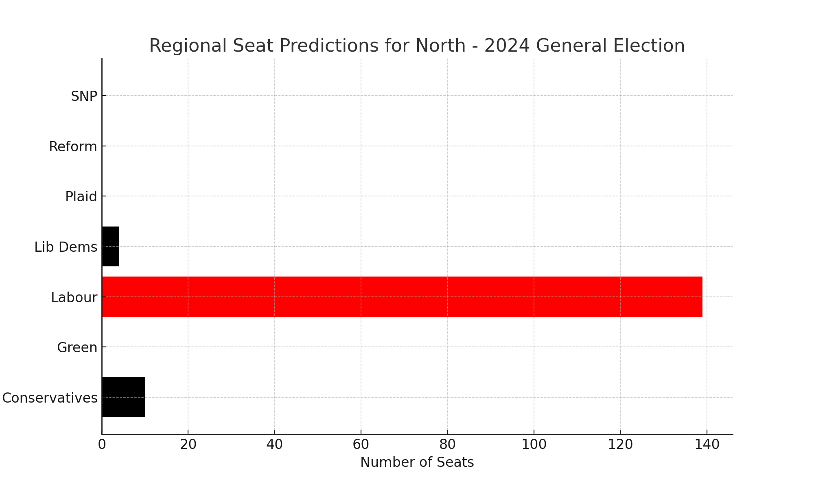
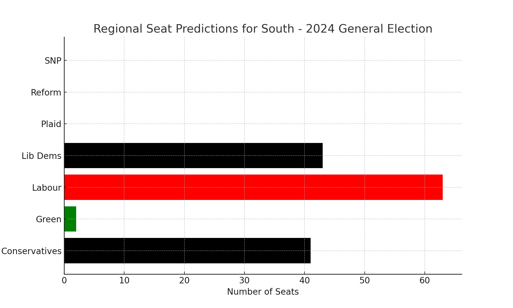
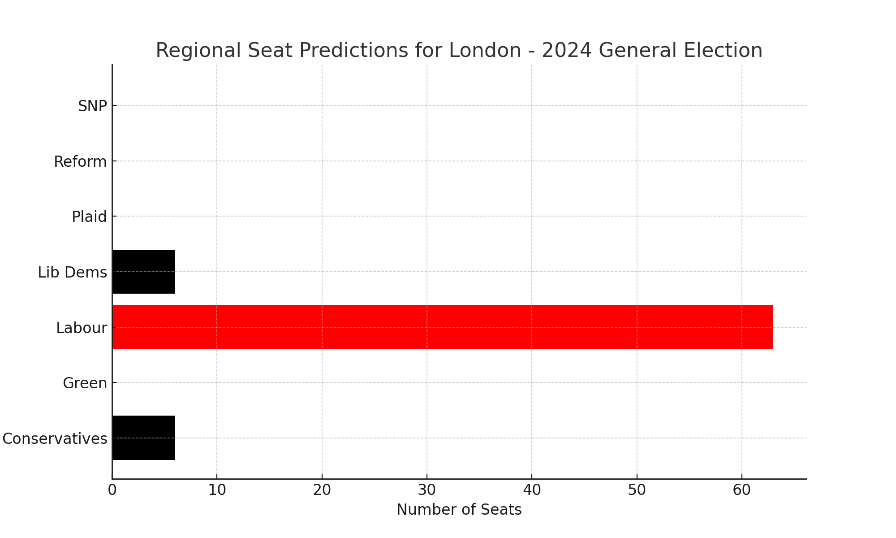
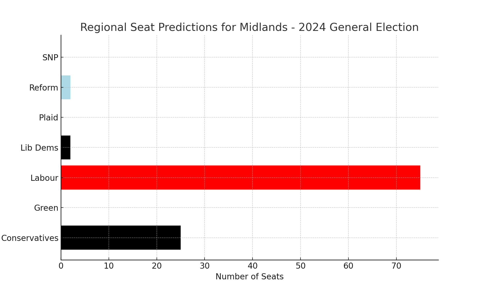
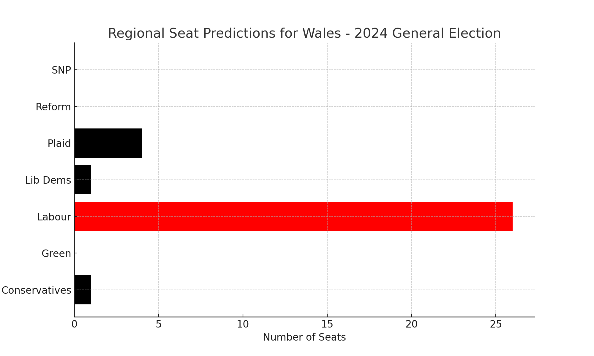
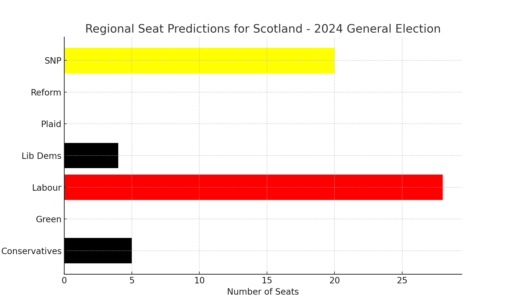

# GovUK Poll Analysis

## Overview

This repository contains an analysis of the YouGov MRP poll showing projected results by parliamentary constituency for the 2024 UK General Election.

## Visualizations

### Overall Seat Predictions

### Regional Seat Predictions

#### North

#### South

#### London

#### Midlands

#### Wales

#### Scotland

## Additional Analyses with More Time

- **Trend Analysis:** Compare the 2024 predictions with previous election results to identify trends and shifts in voter preferences.
- **Margin of Victory:** Analyze the margin of victory for each constituency to understand the competitiveness of different areas.
- **Demographic Impact:** Incorporate demographic data to explore how factors like age, education, and income influence voting patterns.
- **Geospatial Analysis:** Create detailed maps to visualize the geographic distribution of party support and identify regional strongholds.
- **Interactive Map:** If provided with a map, I would create an interactive map displaying predicted results by constituency, including predicted margins for each area.
